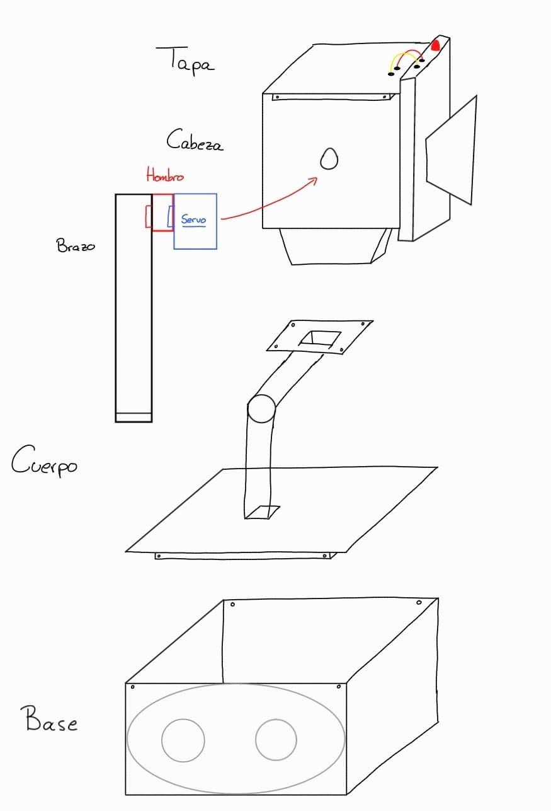

# Robot Mantequilla

Este proyecto se basa en replicar el robot mantequilla de la serie **Rick and Morty**, el cual su única función es traer mantequilla. Este README proporciona toda la información necesaria para clonar el repositorio, reunir los materiales, ensamblar el robot, cargar el código y comenzar a usarlo.

---

## 🔧 Requisitos y Materiales

### Hardware Necesario
- **Componentes Electrónicos:**
  - Arduino Uno
  - ESP32-CAM ❌
  - 2 Motores DC 6V
  - 2 Micro Servo SG90
  - Controladores de motor L298N
  - 2 Batería 9V
  - Cableado y conectores

- **Piezas Impresas en 3D:**
  - Archivo STL: [Enlace a los archivos STL](https://github.com/jmartinm2021/Proyecto-Mecatronica/tree/main/3d_model/final_version)
  - Archivos gcode para imprimir: [Enlace a los archivos gcode](https://github.com/jmartinm2021/Proyecto-Mecatronica/tree/main/3d_print/final_version)
  - 30 Tornillos M2 x 6
  - Herramientas necesarias: destornilladores, alicates, impresora 3D.

### Software Necesario
- Arduino IDE
- Librería necesaria: [servo.h](https://docs.arduino.cc/libraries/servo/)

---

## 🎨 Impresión y Preparación de Piezas

1. **Descarga los archivos gcode:**
2. **Configura tu impresora 3D:**
   - Material recomendado: PLA
   - Resolución de capa: 0.2 mm
   - Relleno: 20%
3. **Imprime todas las piezas necesarias:**

---

## ⚙️ Montaje

1. **Montaje de las ruedas:**
   - Sigue la siguiente guía para el montaje de las ruedas: !!!!!!!!!!!!!!!!!!
   - Una vez estén montadas, conecta las ruedas con la [base](https://github.com/jmartinm2021/Proyecto-Mecatronica/blob/main/3d_model/final_version/base.FCStd) mediante los [soportes](https://github.com/jmartinm2021/Proyecto-Mecatronica/blob/main/3d_model/final_version/soportes.FCStd) y conecta los motores y el controlador a la arduino (el controlador y la arduino deben estar dentro de la base).

2. **Unir Cabeza y Cuerpo:**
   - Une la cabeza con el cuerpo usando tornillos.

3. **Conectar los micro servos:**
   - Conecta los micro servos usando cables largos ya que estos irán por dentro del cuerpo. Encajalos en los agujeros de la cabeza y mete los cables por dentro del cuerpo. Finalmente, conecta los cables a la arduino.

4. **Ensambla las piezas impresas:**
   - Une el cuerpo con la base, y la tapa con la cabeza.

5. **Conectar los brazos:**.
   - Encaja un hombro en cada brazo
   - Une cada brazo con un micro servo.

Usa como guía de conexión la siguiente imagen:

Usa como guía de montaje la siguiente imagen:

---

## 🔄 Cargar el Código

1. **Abrir el proyecto:**
   - Abre el archivo `code/codigo_final.ino` en Arduino IDE.
2. **Instalar librerías:**
   - Asegúrate de instalar las librería necesaria.

3. **Subir el código:**
   - Conecta el microcontrolador al PC mediante un cable USB.
   - Selecciona el puerto correcto en el IDE y sube el código.

---

## 📺 Imagen Final

Aquí tienes una referencia del robot ensamblado:

Cambiar foto!!!!!

---

## 📄 Licencia
Este proyecto está licenciado bajo la licencia [GNU Lesser General Public License](https://www.gnu.org/licenses/old-licenses/lgpl-2.1.html).

---
